# Dungeon Layout Generator

# Descriere

Asadar acum demonstram un algoritm pentru generarea procedurală de 'temnițe/joc' 3d, am folosit unity 3d pentru asta, dar aceste concepte pot fi folosite în orice motor de joc, practic urmarind pasii algoritmului creat acestea vor fi reproduse asemanator, scopul acestui proiect este de a genera un layout pentru joc/temnițe unice și interesante de explorat. 

O temniță/joc constă din camere conectate prin holuri; temnițele pot avea mai multe etaje, iar camerele de la etaje diferite vor fi conectate prin scări.

Aruncă o privire la acest nivel generat aleatoriu de la intrarea în dungeon, în timp ce există o cale simplă de la camera de început până la camera de la capăt `Rosu`. Sunt, de asemenea, ramuri în alte zone, acestea fac temnița mai interesantă de explorat, deoarece conțin elemente suplimentare și întâlniri care creaza o experienta deosebita `Albastru`.

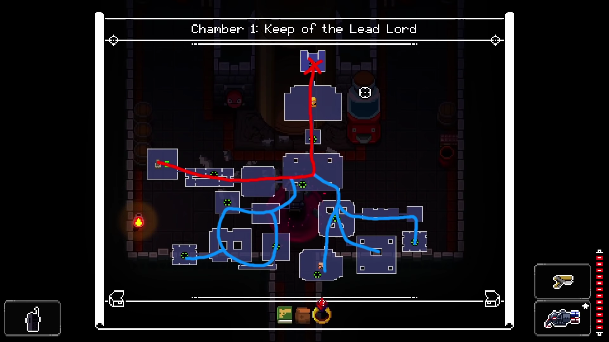

Există o mulțime de moduri diferite de a aborda această problemă. În cele din urmă, am decis să-mi bazez algoritmul pe [această postare reddit](https://www.reddit.com/r/gamedev/comments/1dlwc4/procedural_dungeon_generation_algorithm_explained/) care descrie algoritmul dat intr-o forma casuala, algoritmul original funcționează doar în 2d, pentru 3d am folosit algoritmul modificat si extins de către vazgriz [descris aici](https://vazgriz.com/119/procedurally-generated-dungeons/).

***

### Voi explica mai întâi algoritmul de generare a temniței pentru două dimensiuni:

- Pasul 1: Plasează camerele în temniță, nu contează cu adevărat cum sunt aranjate  deci, pentru acest exemplu, le-am dat o dimensiune și o locație aleatorie.

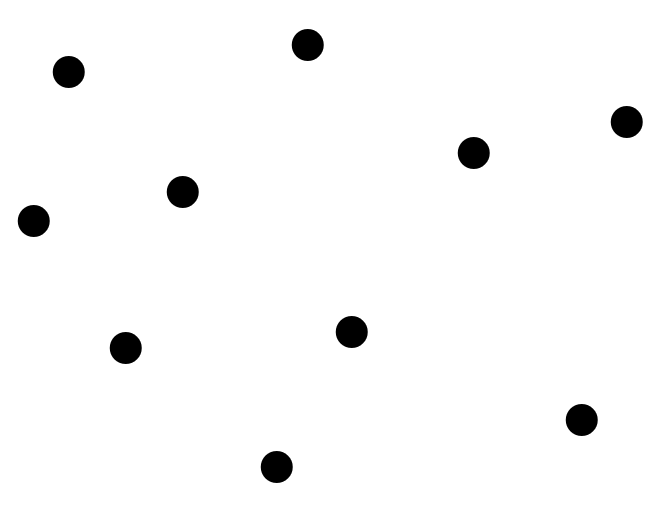

- Pasul 2: Cream un graf, virfurile fiind formate din fiecare cameră creată, graful este creat dintr-o colecție de puncte care reprezinta locatile aleatorii ale camerolor create anterior, este necesar de a crea graful cu multe conexiuni între punctele din apropiere, având margini relativ scurte în această diagramă, fiecare punct este o cameră și fiecare margine este un potențial hol în temniță, nu fiecare margine va fi folosită, deoarece aceasta ar crea o temniță prea înghesuită cu prea multe căi pentru parcurse, avem nevoie de o modalitate de a reduce numărul de margini alese pentru temnița finală.

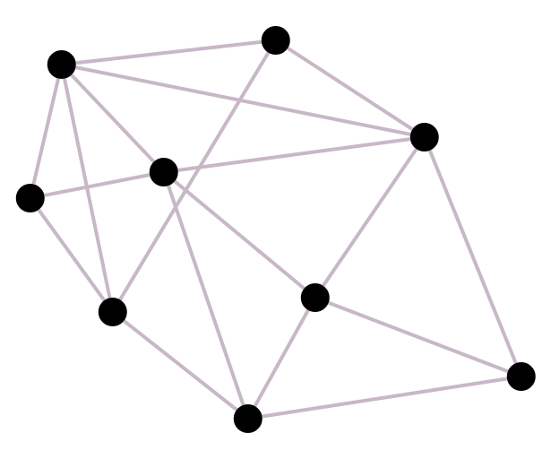

> Aici o puteți vedea construit cu linii verzi (de facut exemple concret in algoritm pas cu pas cum se unesc liniile la graf (doar cateva deoarece la noi se unesc toate cu toate))

- Pasul 3: Creem un arbore de acoperire minim din graful primit la pasul precedent, pentru aceasta. Folosesc algoritmul lui `Kruskal`, MST garantează că fiecare cameră va fi accesibilă, totuși, deoarece este un arbore, nu conține cicluri, există doar o singură cale dintr-o cameră în orice altă cameră, marginile din mst sunt marcate cu verde acestea vor fi folosite ca holuri, marginile rămase din graful initial sunt marcate cu gri aceste holuri pot fi folosite în temnița finală.

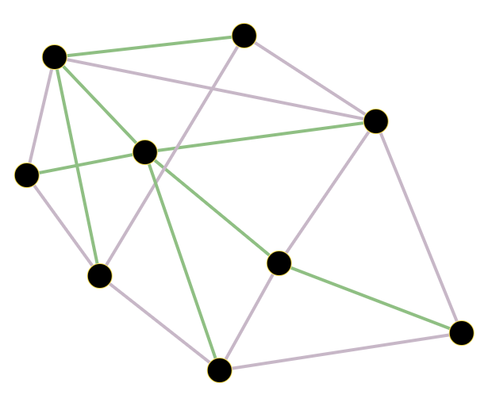

- Pasul 4: Alegem aleatoriu din potențialele holuri, în timp ce mst-ul conține fiecare cameră, aceste conține totusi doar un număr mic de margini, iau marginile gri care nu sunt în mst și aleg aleatoriu unele dintre ele pentru a fi holuri, aceasta va adăuga câteva bucle la temniță făcând-o mai interesant cu un potențial de explorare mai mare, aici am folosit o șansă de 12,5% pentru fiecare margine care urmează să fie aleasă din totalul de margini ramase.

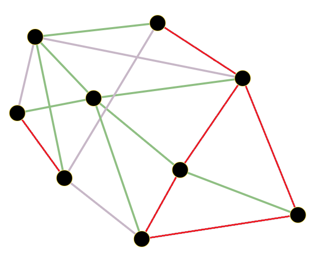

- Pasul 5: Pentru fiecare hol, utilizăm algoritmul a* pentru a găsi o cale între
cele două camere, acesta fiind bazat pe o functie de cost realizata in asa mod ca aceasta sa poata treaca prin cameri, dar operatiunea data este mai scumpa decat trecerea prin celule goale neocupate, astel motivand a* ca coridoarele sa fie create ocolind camerele. [A* pathfinding algorithm](https://medium.com/@nicholas.w.swift/easy-a-star-pathfinding-7e6689c7f7b2)

Sa aruncam o privire la modul în care funcționează algoritmul A*

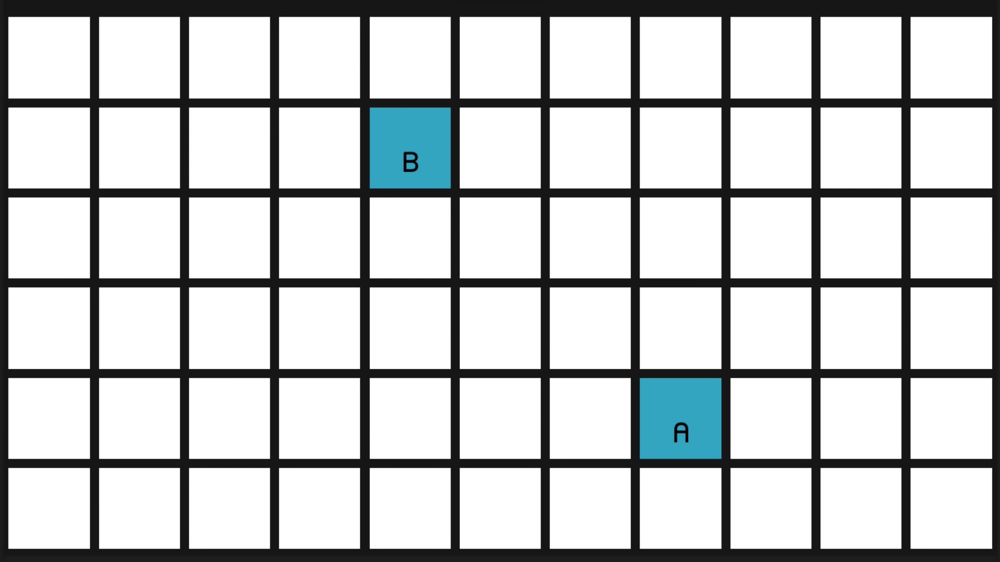

Bine, deci aici avem o grilă de noduri, nodurile albe reprezentând zonele pe care se poate parcurge pe harta noastră și nodurile albastre reprezentand noduri de inceput si sfirsit de asemenea pot fi noduri negre reprezentând obstacolele.

Deci, desigur, încercăm să găsim calea cea mai scurtă de la nodul A la nodul B și ceea ce trebuie să facem mai întâi este să decidem cât de departe sunt nodurile. Deci ar fi destul de firesc să spunem că distanța dintre două noduri este una. Și, prin urmare, după Pitagora, distanța în diagonală va fi rădăcina pătrată a lui doi, care este aproximativ un virgul patru. Așadar, o practică destul de obișnuită este doar să înmulți acele două numere cu 10 și să folosești valorile întregi frumoase de 10 pe tot și pe verticală și 14 pentru diagonale. Aceasta distanta se numeste [Distanță Manhattan](https://ro.wikipedia.org/wiki/Distan%C8%9B%C4%83_Manhattan).

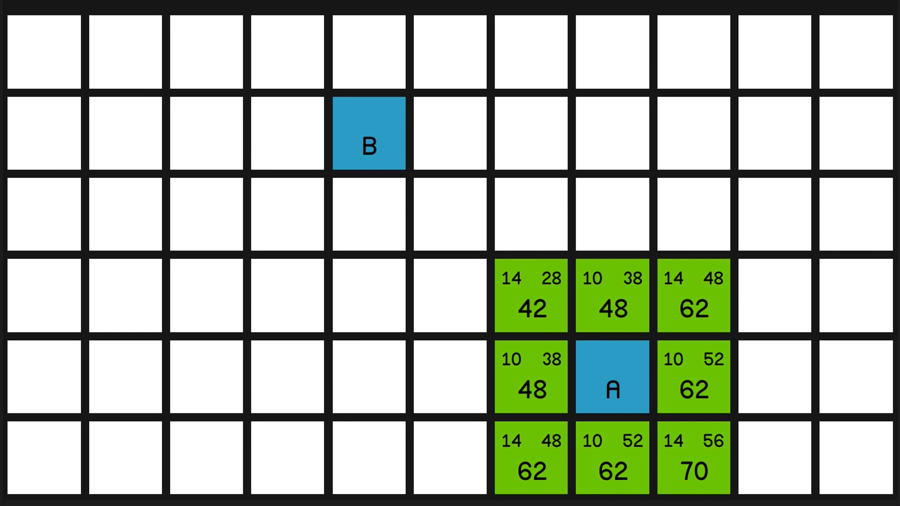

Deci algoritmul începe prin a merge la nodul de pornire, nodul A de aici, și se uită la toate nodurile din jur și calculează niște valori pentru fiecare dintre ele. Deci, valorile din colțul din stânga sus al fiecărui nod se numesc costul nodurilor G. Și asta este pur și simplu cât de departe este acel nod de nodul de pornire. Deci, acest nod din colțul din stânga sus are un cost G de 14, deoarece este doar o diagonală depărtare de nodul A.

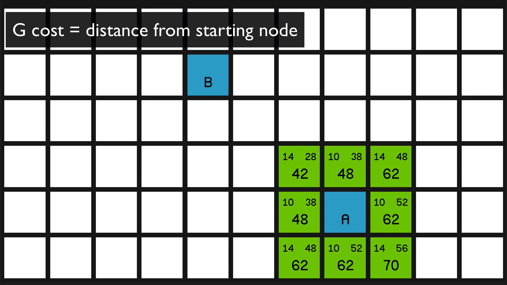

În colțul din dreapta sus al fiecărui nod este costul nodurilor H, care este practic opusul costului G. Este cât de departe este nodul de nodul final. Deci, acest nod se află la două mișcări diagonale față de nodul final, deci are un cost H de 28.

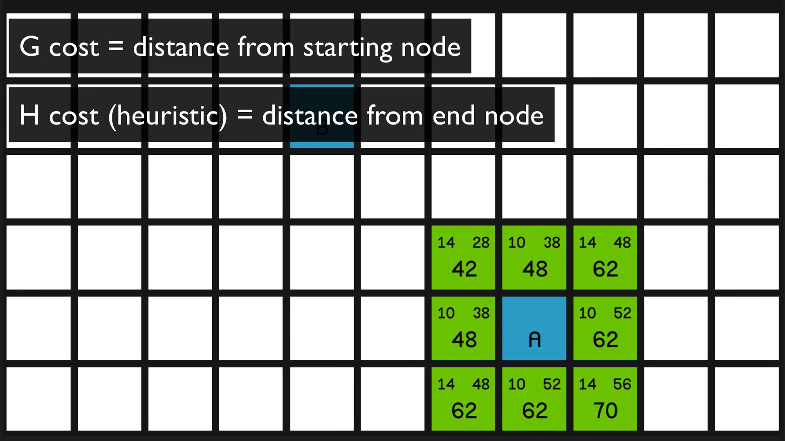

Acum numărul mare este costul F al nodurilor, și acesta este foarte simplu costul G plus costul H. Așa că acum algoritmul va analiza toate aceste noduri și îl va alege pe cel cu cel mai mic cost F pentru a se uita mai întâi.

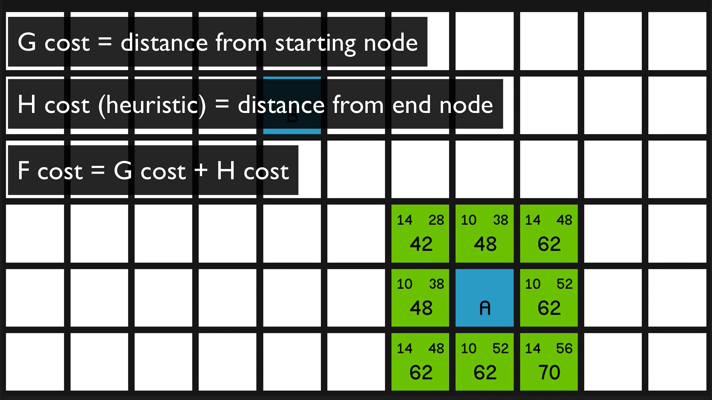

Și acesta este, desigur, acest 42 din colțul din stânga sus. Deci va marca acest lucru acum ca închis, astfel încât va apărea roșu și apoi va calcula din nou toate aceste valori pentru toate nodurile din jur continuand la fel pentru fiecare nod in continuare, alegand nodul cu valoare F cost mai mica, daca acestea fiind egale ne uitam la G cost.

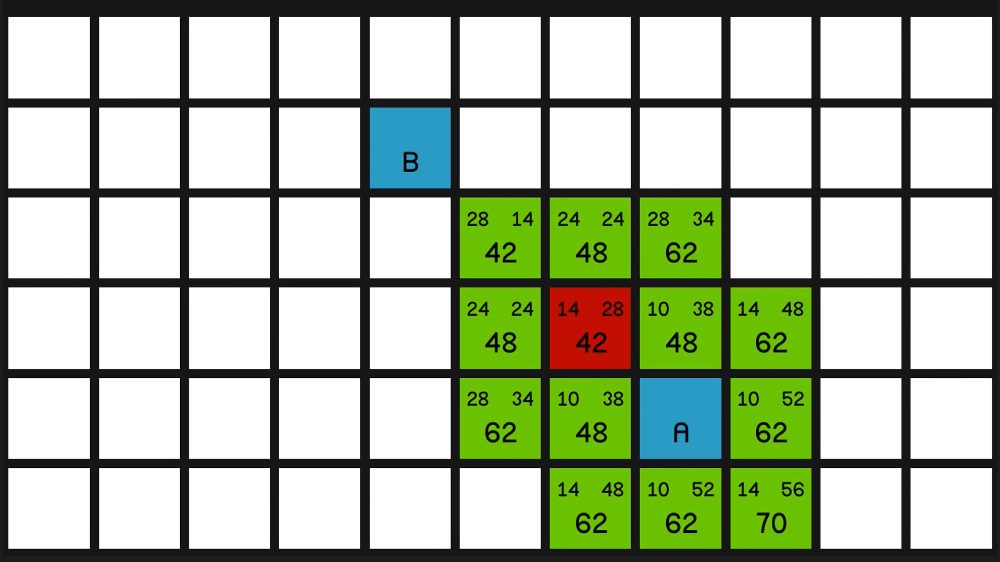
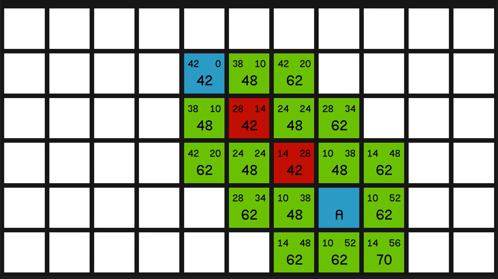
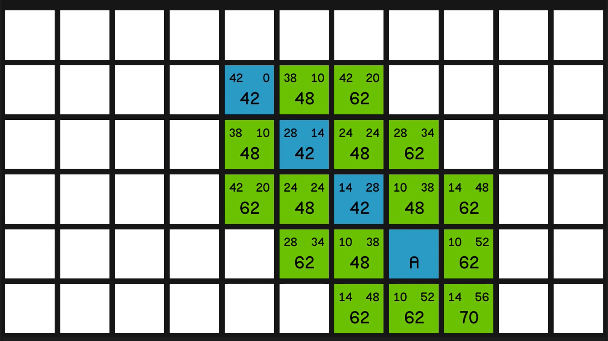

> De adaugat un gif cum se adauga holurile pas cu pas, si gen spunem aici puteti vedea cum holurile apar ca cuburi albastre etc

Acum avem camerele și holurile noastre într-un joc real, putem sa le adaugam modele pentru interior, am putea marca una dintre camere ca camera de început și alta ca camera de sfârșit, boss room, alte camere ar putea conține comori monștri sau orice altceva.

### în rezumat, această temniță este creată cu acești pași:

- Pasul 1: Plasăm camerele 
- Pasul 2: Cream un graf, varfurile sunt pozitiile camerelor
- Pasul 3: Creem un arbore de acoperire minim din graful primit
- Pasul 4: Alegem aleatoriu din potențialele holuri neincluse in MST
- Pasul 5: Gasim holurile, prin pathfinding, [a*](https://medium.com/@nicholas.w.swift/easy-a-star-pathfinding-7e6689c7f7b2)

### Pentru a extinde generatorul de temniță la 3d trebuie doar să folosim versiunile 3d ale fiecărui algoritm:

- Pasul 1: Generam camere în 3d în loc de 2d unele dintre camere sunt  acum plasată pe etaje diferite, această schimbare este casuala.
- Pasul 2: Creati graful, aici se poate de folosit exact aceiasi metoda precum in 2d, doar trebuie de tinut cont ca deja varfurile mai au o coordinata - z.
- Pasul 3: Un graf de acoperire poate fi creat trivial din marginile grafului creat anterior.
- Pasul 4: Alegem aleatoriu holurile din cele neincluse in graful de acoperire, pasul dat este de asemenea, trivial.
- Pasul 5: Găsirea holurilor prin pathfinding, a*, de aici se complică, de aici presupun că ești familiarizat cu modul în care funcționează a* pe plan intern, versiunea pentru temnița 2d este implementarea simplă standarta a unui a*, Pentru a o face 3d a trebuit sa fie adaugata posibilitatea ca pathfinderul să se miște în sus și în jos pentru a conecta camere de pe etaje diferite, totuși algoritmul standard a* nu ar avea un comportament special pentru aceasta, mișcându-se pe verticală acesta ar putea crea o structură de scară, dar ar putea merge și direct în sus si acestea ambele reprezentand drumul cel mai minim si optim dintre ele. Aveam nevoie de un sistem care să ofere mai mult control asupra acestui lucru. **Adica de o implementare specializata pentru algoritmul a\***

Structură de scară!

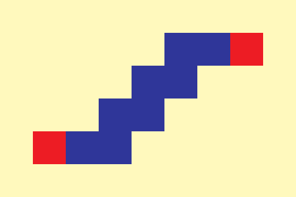

Direct in sus

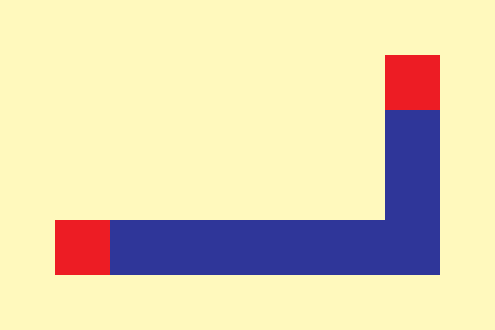

Implementarea data este realizata de catre [vazgriz](https://vazgriz.com/119/procedurally-generated-dungeons/), aceasta modifica deplasarea pe verticala a algoritmului a*, adaugand o structura intermediara - scari , acestea fiind folosite pentru deplasarea intre etaje. O scara cam arata asa `(verde pe desen)`, scara în sine necesită patru plăci, casetele/celule albastre sunt placi normale pe hol. Initial se creaza holurile, si apoi scara se conecteza la acest hol, marcandu-se in grid fiecare pozitie ca scara ca a* sa evite trecerea prin acestea 

Solutia

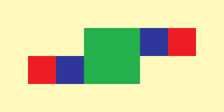

Solutia Interior

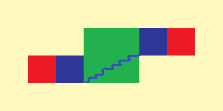

### Acest algoritm este o bază bună pentru un generator de temnițe, acesta reprezentand o baza buna pentru a crea un joc complet.

***

## Implementarea specifica a algoritmului descris anterior in cod.

Setam marimea la Grid, pe x, y si z, aceasta are scopul de a mentine informatia despre fiicare celula si de a transmite informatia data algoritmului pentru executarea acestuia.

In cod algoritmul este realizat in 3 etape:

      Generate()
      {
          PlaceRooms();
          CreateGraph();
          Pathfind();
      }

Sa analizam mai detaliat fieacare pas din algoritmul implementat:

- `PlaceRooms();` -> Pentru functionearea acestea cream o clasa simpla `Room` si o metoda `Intersect(Room a, Room b);`, clasa `Room` va detine informatia despre camerele noastre si anume, `BoundsInt(position, size);` - o structura formata din 2 elemente, pozitia camerei, si marimea acesteia, pozitia camerei si marimea este la randul sau o structura din 3 elemente `Vector3Int(x, y, z);`, pentru a opera mai usor cu aceste 3 marimi odata.  
Trecem la implementarea functie `PlaceRooms();`, aceasta este realizata la randul sau din 3 etape:  
**Prima etapa** (crearea) - se creaza random pozitia camerei si marimea acesteia  
**A doua etapa** (verificarea) - se verifica daca camera creata nu se incadreaza in grid, si daca camera se intersecta cu alte camere create anterior, daca conditiile nu se indeplinesc atunci ne intoarcem la prima etapa.  
**A treia etapa** (plasarea) - Daca conditiile sunt satisfacute creem camera pe harta si o marcam in grid, cu fiecare celula din care este formata camera, deasemeni adaugam camera intro lista impreuna cu celelalte camere pentru pentru a le pastra.  
Pasii se repeta pentru numarul de camere necesar, cate camere dorim sa creem de atatea ori le repetam.
**Pseudocod:**

      PlaceRooms()
      {
          for (0 to numarulDeCamere)
          {
              add = true;
              do 
              {
                  Position = random(x, y, z);
                  Size = random(x, y, z);
                  Room newRoom = new(Position, Size);
                  if (newRoom is in Grid)
                      add = false;
                  if (newRoom.Intersect(others))
                      add = false;
              } while (add);
              PlaceRoom(newRoom);
              SetInGrid();
              ListRooms.add(newRoom);
          }
      }

***

- `CreateGraph();` -> Creem o clasa `Graph` cu metodele de creare a grafului, gasire a drumului minim si adaugare aa laturilor adaugatoare. Pentru aceasta avem nevoie de doua clase suplimentare `Varf` si `Muchie`.  
Clasa `Varf` detine informatia despre varf, aceasta se creaza din camerele create anterior, positia camerelor slujind ca Positia varfului.  
Clasa `Muchie` este formata din 2 varfuri si o metoda menita sa calculeze distanta dintre aceste varfuri.  
Metoda se va realiza in doua etape:  
**Prima etapa** (Crearea varfurilor) - Luam din lista de camere creata la etapa precedenta datele despre camera, si anume pozitia acesteia, creeind astfel o lista de varfuri cu positiile camerelor.  
**A doua etapa** (Formam graful) - Unim toate muchiile din lista formand muchii, graful este format practic in unind fiecare varf cu fiecare, creiind o multime de conexiuni.  
Etapa data ar putea fi optimizata daca de folosit algoritmi de creare a grafului precum [Delaunay triangulation](https://en.wikipedia.org/wiki/Delaunay_triangulation) aceasta tinde să evite lungi triunghiuri, acesta creeand o mulțime de conexiuni între punctele din apropiere, având margini relativ scurte, si cu un numar mic, aceasta este un algoritm efectiv care practic creaza automat cel mai minim graf posibil. Pentru folosirea acestuia in 3d este nevoie de [Algoritmul Bowyer–Watson](https://en.wikipedia.org/wiki/Bowyer%E2%80%93Watson_algorithm) care este o metoda de calcul a triangulației Delaunay a unui set finit de puncte în orice număr de dimensiuni, dar aceasta este prea complexa si complicata.  
Din aceasta cauza am folosit algoritmul metoda data de unire a fiecarui varf cu toate varfurile, formand un graf foarte complex. Din cauza metodei date se formeaza un numar de muchii foarte mare ce poate fi calculat dupa formula: `L = (N * (N - 1) ) / 2` unde `L` - numarul de laturi primit iar `N` - numarul de varfuri.  
De exemplu pentru un graf de 20 de varfuri `N = 20` numarul muchiilor create va fi de `L = 190`,  `N = 30 => 435` putem observa ca numarul de laturi creste foarte rapid.  
**A treia etapa** (Creem MST) - Folosim Algoritmul Kruskal pentru a forma graful de acoperie minim din Graful crea anterior.  
**A patra etapa** (Adaugam Laturi Extra) - Alegem aleatoriu din laturile ramase ce nu au fost incluse in raport si le adaugam cu MST creat.  
**Pseudocod**

        CreateGraph()
        {
            List varfuri = ListRooms.GetPositions();
            Graph newGraph = CreateGraph(varfuri);
            foreach (Varf firstVertex in vertices)
                {
                    foreach (Varf secondVertex in vertices)
                    {
                        if (firstVertex != secondVertex)
                        {
                            Edge newEdge = new Edge(firstVertex, secondVertex);
                            edges.Add(newEdge);
                        }
                    }
                }
            newGraph.Kruskal(edges);
            newGraph.AddExtraEdges();
        }

- `Pathfind();` - Acesta este realizat practic exact ca si a* original, fiind modificat pentru a procesa trecerea dintre nivele, folosind o structura care defapt reprezinta scarile.  
Algoritmul verifica daca este posibil/necesar de creat drum de pe un nivel pe altul, acest lucru este realizat astfel:  
Pozitia in care se afla acum pathfinderul, cu alte cuvinte celula/nodul procesat in momentul dat este descrisa de variabila `current` care este o structura de tipul `Vector3Int(x, y, z)` descrisa anterior, variabila `prev` descriind positia anterioara in care se afla pathfinderul.  
Pentru simplificare a folosintei a fost realizata supraincarcarea operatorului `-` scadere, acesta returnand diferenta la fiecare variabila (x, y, z).  
In `Pathfind();` in proces se realizeaza o diferenta dintre `current` si `prev` rezultatul acesteaia fiind `delta`, dupa care verificam valoarea lui `y` din delta, daca aceasta este diferit de 0 => ca pathfinderul sa mutat pe o celula in jos sau in sus față de celula `prev` si noi in locul dat trebuie sa inseram o "scara".  
Structura scarii este formata practic din 4 celule, aflam pozitiile acestora si marcam in grid ca acestea deja sunt scari, celulele fiind ocupate. Pozitiile date le aflam in baza directiei in care ne deplasam ce se ia de asemenea din `delta`.  
**Sectiunea de Pseudocod**

        ...
        var delta = current - prev;

        if (delta.y != 0)
        {
            Vector3Int verticalOffset = new Vector3Int(0, delta.y, 0);
            Vector3Int horizontalOffset = new Vector3Int(xDirirection, 0, zDirection);

            grid[prev + horizontalOffset] = CellType.Stairs;
            grid[prev + horizontalOffset * 2] = CellType.Stairs;
            grid[prev + verticalOffset + horizontalOffset] = CellType.Stairs;
            grid[prev + verticalOffset + horizontalOffset * 2] = CellType.Stairs;

            PlaceStairs(prev + horizontalOffset);
            PlaceStairs(prev + horizontalOffset * 2);
            PlaceStairs(prev + verticalOffset + horizontalOffset);
            PlaceStairs(prev + verticalOffset + horizontalOffset * 2);
        }
        ...

Demonstrarea pozitiilor scarilor

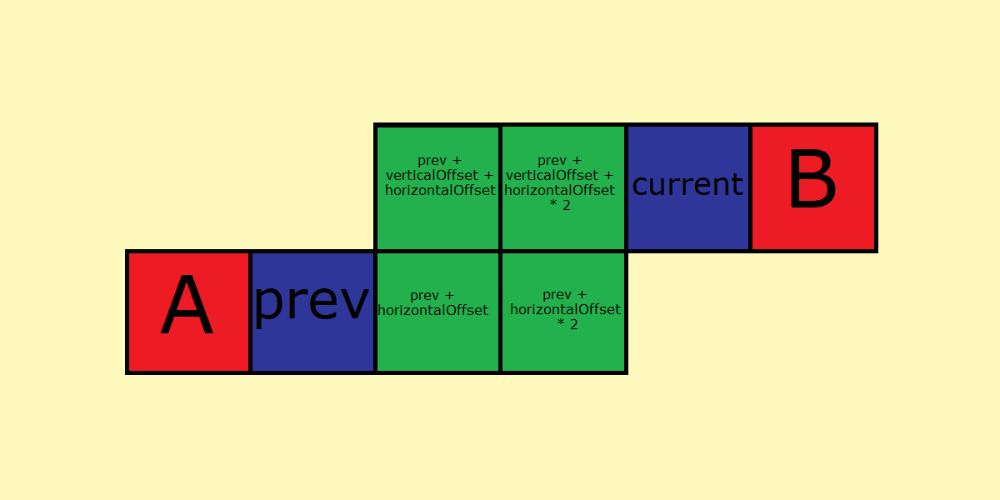

## Steps

1.Set points (Rooms)

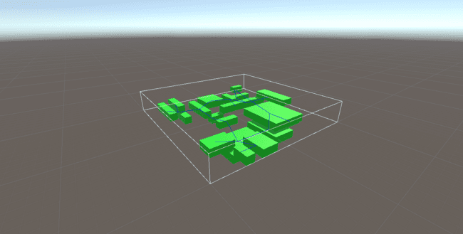

2.Create Graph

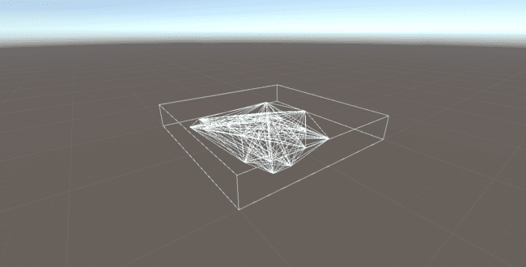

3.MST

*Kruskal*

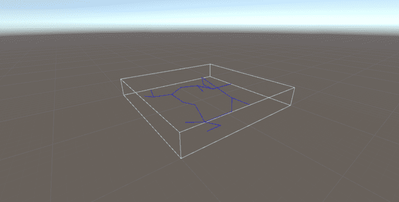

*Prim*

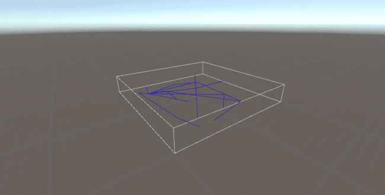

4.Pathfind

*Kruskal*

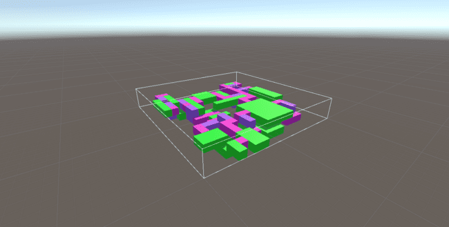

*Prim*

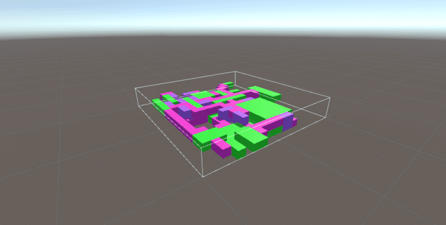