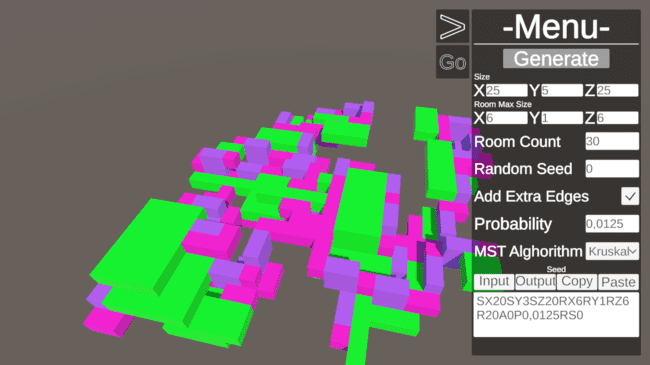

# Dungeon Layout Generator

This project is an implementation of procedural generation algorithms for creating a game layout.

The algorithm for procedural generation is based on the algorithm described in [this post](https://www.reddit.com/r/gamedev/comments/1dlwc4/procedural_dungeon_generation_algorithm_explained/) on the r/gamedev subreddit and the modified algorithm by vazgriz [described here](https://vazgriz.com/119/procedurally-generated-dungeons/).

## Screenshots

## Description

In file [this](Notes/Proiect.md) file located in `Notes/Proiect.md` is described the algorithm. It represents the notes during the realization of the project. And it is in Romanian.

## License

The A* alghorithm in Dungeon Pathfinder 3D is by Ryan Vazquez. 
The license can be found in `Assets/Scripts/DungeonPathfinder3D.cs`.